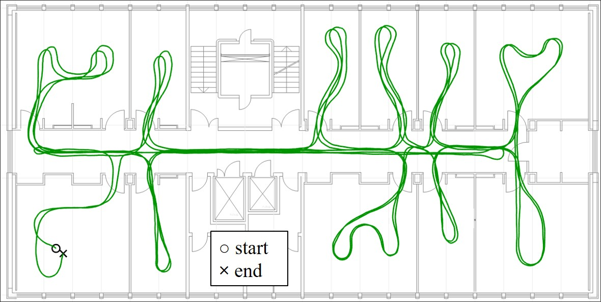
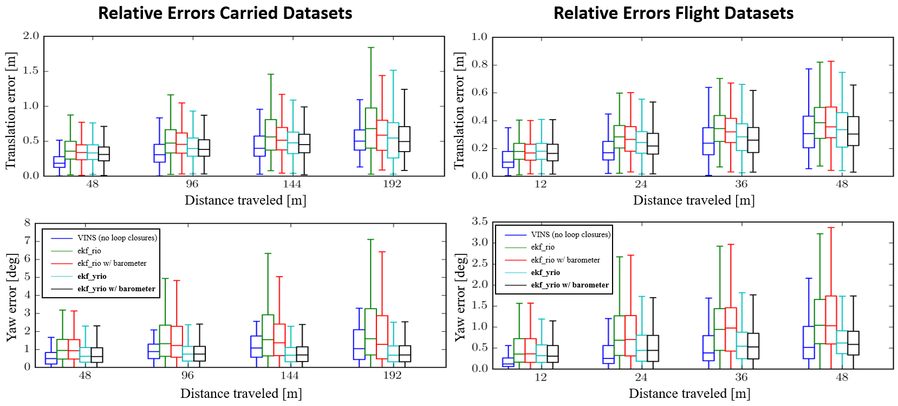

# ekf_yrio: Extended Kalman Filter based Yaw aided Radar Inertial Odmetry

This package extends [ekf_rio](../ekf_rio) with yaw aiding based on Manhattan world assumptions for indoor environments.
We used an instantaneous approach which can provide yaw aiding without scan matching.
In contrast to [ekf_rio](../ekf_rio), ekf_yrio estimates all IMU offsets (even the yaw rate offset) which results in
 accurate state estimation even on long indoor datasets.
An evaluation with the [radar_inertial_datasets_icins_2021](https://christopherdoer.github.io/datasets/icins_2021_radar_inertial_odometry) shows that ekf_yrio achieves even 
slightly better accuracies than the state of the art VIO framework [VINS (no loop closures)](https://github.com/HKUST-Aerial-Robotics/VINS-Fusion).
We outperform VINS regarding runtime as ekf_yrio runs almost 90x faster than VINS!

Check out our paper for more details [Yaw aided Radar Inertial Odometry uisng Manhattan World Assumptions](https://christopherdoer.github.io/publication/2021_05_ICINS2021).

## Cite
If you use ekf_yrio or the provided datasets for your academic research, please cite our related paper:

~~~[bibtex]
@INPROCEEDINGS{DoerICINS2021,
  author={Doer, Christopher and Trommer, Gert F.},
  booktitle={2021 28th Saint Petersburg International Conference on Integrated Navigation Systems (ICINS)}, 
  title={Yaw aided Radar Inertial Odometry uisng Manhattan World Assumptions}, 
  year={2021},
  pages={1-10}
~~~

## Paper Datasets
All carried and flight datasets presented in our Paper "Yaw aided Radar Inertial Odometry uisng Manhattan World
 Assumptions" are available online: [radar_inertial_datasets_icins_2021](https://christopherdoer.github.io/datasets/icins_2021_radar_inertial_odometry). 
These datasets also include pseudo ground truth which has been created using [VINS (with loop closures)](https://github.com/HKUST-Aerial-Robotics/VINS-Fusion).

## Demo Results

### Autonomous Indoor Drone Flight 

### Indoor Demos and Evaluations

### Indoor Dataset "Carried 2"

The image below shows the estimation result of ekf_yrio for the indoor dataset "carried_2" (part of
  [radar_inertial_datasets_icins_2021](https://christopherdoer.github.io/datasets/icins_2021_radar_inertial_odometry)).   
This dataset covers a trajectory length of 451m over a period of 392s whereas the start and end pose are equal.
 ekf_yrio achieved a final position error of 0.14% of the distance traveled. 
 Processing of the whole dataset took just 4.32s with an Intel NUC i7 and 36s with an UpCore embedded computer
  

### Results on Datasets: [radar_inertial_datasets_icins_2021](https://christopherdoer.github.io/datasets/icins_2021_radar_inertial_odometry)

***Translation RMSE Carried Datasets*** 

| Algorithm | carried_1 | carried_2 | carried_3 | carried_4 | carried_5 | Mean
--- | --- | --- | --- | --- | --- | ---
[VINS (no loop closures)](https://github.com/HKUST-Aerial-Robotics/VINS-Fusion) | ***0.21*** | 0.33 | 0.33 | 0.41 | ***0.20*** | 0.30
[ekf_rio](../ekf_rio) w/o barometer  | 0.67 | 0.30 | 0.32 | 0.37 | 0.37 | 0.41
[ekf_rio](../ekf_rio) w/ barometer   | 0.65 | 0.27 | 0.29 | 0.36 | 0.31 | 0.37
ekf_yrio w/o barometer | 0.30 | ***0.23*** | 0.29 | 0.35 | 0.36 | 0.30
ekf_yrio w/ barometer | 0.32 | 0.27 | ***0.23*** | ***0.31*** | 0.28 | ***0.28***
    
***Translation RMSE Flight Datasets***    

| Algorithm | flight_1 | flight_2 | flight_3 | flight_4 | Mean
--- | --- | --- | --- | --- | --- 
[VINS (no loop closures)](https://github.com/HKUST-Aerial-Robotics/VINS-Fusion)  | 0.39 | 0.13 | ***0.17*** | 0.19 | 0.22
[ekf_rio](../ekf_rio) w/o barometer  | 0.32 | 0.15 | 0.29 | 0.31 | 0.27
[ekf_rio](../ekf_rio) with barometer   | 0.28 | 0.17 | 0.27 | 0.31 | 0.26
ekf_yrio w/o barometer  | 0.27 | ***0.12*** | 0.31 | ***0.16*** | 0.22
ekf_yrio with barometer  | ***0.23*** | 0.15 | 0.26 | ***0.16*** | ***0.20***

***Relative Errors***

 

***This analysis shows that ekf_yrio improves ekf_rio clearly achieving even slightly better mean translation RMSE than the state of the art VIO framework VINS!***   
This analysis can be generated using a single [script](./python/icins_2021_evaluation.py), see below "Run the radar_inertial_datasets_icins_2021".

## Getting Started

Run ekf_yrio with the "carried_2" dataset in rosbag mode and start rviz for visualization:

~~~[shell]
roslaunch ekf_yrio demo_datasets_ekf-yrio_rosbag.launch
~~~

Run without rviz:

~~~[shell]
roslaunch ekf_yrio demo_datasets_ekf-yrio_rosbag.launch enable_rviz:=False
~~~

Run in online mode:

~~~[shell]
roslaunch ekf_yrio demo_datasets_ekf-yrio_ros.launch
rosbag play --clock radar_inertial_datasets_icins_2021_carried_2.bag
~~~

## Run the radar_inertial_datasets_icins_2021

Run a single dataset (e.g. carried_1) of the [radar_inertial_datasets_icins_2021](https://christopherdoer.github.io/datasets/icins_2021_radar_inertial_odometry) dataset:

~~~[shell]
roslaunch ekf_yrio icins2021_datasets_ekf-yrio_rosbag.launch dataset_dir:=<path_to_dataset> rosbag:=carried_1.bag
~~~

Run and evaluate all runs of the [radar_inertial_datasets_icins_2021](https://christopherdoer.github.io/datasets/icins_2021_radar_inertial_odometry) dataset 
(depends on [rpg_trajectory_evaluation](https://github.com/christopherdoer/rpg_trajectory_evaluation), see Getting Started in [README](../README.md) for installation):

~~~[shell]
rosrun ekf_yrio icins_2021_evaluation.py _rosbag_base_dir:=<path_to_radar_inertial_datasets_icins_2021>
~~~

This will save the evaluation at <path_to_radar_inertial_datasets_icins_2021>/results for the carried and flight datasets.
The estimation result of ekf_rio and ekf_yrio (with and w/o barometer fusion) are aligned with the ground truth and evaluated using 
[rpg_trajectory_evaluation](https://github.com/christopherdoer/rpg_trajectory_evaluation). 
Plots and further error metrics are located at <path_to_radar_inertial_datasets_icins_2021>/results/<carried/flight>_datasets/evaluation_full_align.

## Nodes

Our ekf_yrio implementation provides two nodes for ROS interfacing:
- ***ros_node:*** Subscribes to all topics and does online processing
- ***rosbag_node:*** Reads a rosbag and runs ekf_yrio at maximum speed

A set of demo parameters is given in [ekf_yrio_default](./config/ekf_yrio_default.yaml).
Most of the parameters can be changed online using rqt_reconfigure. Further documentation of the parameters can be found using the tooltip text in rqt_reconfigure
and in the python files, see [cfg](./cfg).

Published topics are the same for both modes:
- ~state ([ekf_rio/EkfRioState](../ekf_rio/msg/EkfRioState.msg)): full filter state (NED-convention)
- ~covariance ([ekf_rio/EkfRioCovariance](../ekf_rio/msg/EkfRioCovariance.msg)): diagonal elements of covariance matrix
- ~pose ([geometry_msgs/PoseStamped](http://docs.ros.org/en/api/geometry_msgs/html/msg/PoseStamped.html])): pose (ROS convention)
- ~twist ([geometry_msgs/TwistStamped](http://docs.ros.org/en/api/geometry_msgs/html/msg/TwistStamped.html])): twist (ROS convention)
- ~pose_path ([nav_msgs/Path](http://docs.ros.org/en/api/nav_msgs/html/msg/Path.html)): pose path (ROS convention)
- ~radar_scan_inlier ([sensor_msgs/PointCloud2](http://docs.ros.org/en/api/sensor_msgs/html/msg/PointCloud2.html)): radar scan inlier used for velocity estimation
- ~yaw_aiding_init ([sensor_msgs/PointCloud2](http://docs.ros.org/en/api/sensor_msgs/html/msg/PointCloud2.html)): all radar scan point used for Manhattan angle init
- ~radar_scan_yaw_inlier ([sensor_msgs/PointCloud2](http://docs.ros.org/en/api/sensor_msgs/html/msg/PointCloud2.html)): radar scan point used for yaw aiding
