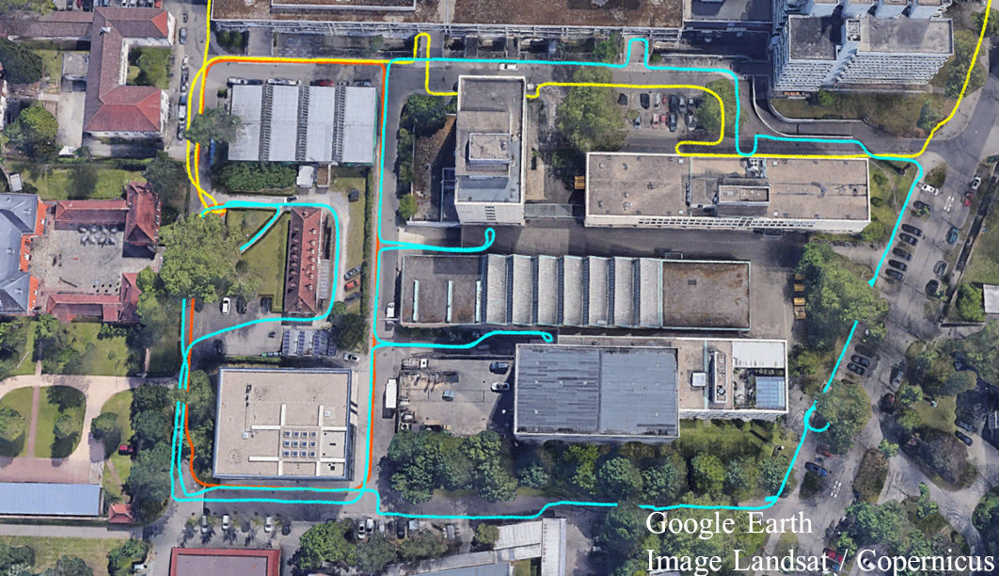

# gnss_x_rio: Radar Inertial Odometry with Multiple Radar Sensors, Yaw Aiding and GNSS Fusion

This packages extends [x_rio](../x_rio) to fuse GNSS-measurements to provide a global navigation system.
As radar and GNSS are not affected by challenging visual conditions such as fog, smoke or darkness, GNSS-X-RIO qualifies as a robust and accurate global navigation system.
The GNSS conditions are filtered and classified within a sliding window.

This package is based on our paper: [GNSS aided Radar Inertial Odometry for UAS Flights in Challenging Conditions](https://christopherdoer.github.io/publications/2022_02_Aeroconf2022)

## Cite
If you use gnss_x_rio or the provided datasets for your academic research, please cite our related paper:

~~~[bibtex]
@INPROCEEDINGS{DoerAeroConf2022,
    author = {Doer, Christopher and Atman, Jamal and Trommer, Gert F.},
    title = { GNSS aided Radar Inertial Odometry for UAS Flights in Challenging Conditions },
    booktitle={2022 IEEE Aerospace Conference (AeroConf}, 
    year={2022}
}
~~~

## Demo Results: [KIT Global Loops Datasets](https://christopherdoer.github.io/datasets/kit_campus_global_loops_aeroconf2022)

## Getting Started

To run the satellite overlay visualization, [mapviz](https://swri-robotics.github.io/mapviz/) is required:
- `sudo apt-get install ros-$ROS_DISTRO-mapviz ros-$ROS_DISTRO-mapviz-plugins ros-$ROS_DISTRO-tile-map  ros-$ROS_DISTRO-multires-image`

Run gnss_x_rio on the demo indoor datasets in rosbag mode and mapviz:

~~~[shell]
roslaunch gnss_x_rio gnss_x_rio_demo.launch type:=rosbag_node enable_mapviz:=True
~~~

Run gnss_x_rio with two radar sensors and mapviz:

~~~[shell]
roslaunch gnss_x_rio gnss_x_rio_demo.launch type:=rosbag_node enable_mapviz:=True n_radar:=2
~~~

Run in online mode:

~~~[shell]
roslaunch gnss_x_rio gnss_x_rio_demo.launch type:=ros_node enable_mapviz:=True
rosbag play --clock demo_gnss_x_rio.bag
~~~

## Run the [KIT Global Loops Datasets](https://christopherdoer.github.io/datasets/kit_campus_global_loops_aeroconf2022)

~~~[shell]
roslaunch gnss_x_rio gnss_x_rio_demo.launch type:=rosbag_node enable_mapviz:=True _rosbag_base_dir:=<path_to_kit_global_loops_datasets>
~~~

## Nodes

Our gnss_x_rio implementation provides two nodes for ROS interfacing:
- ***ros_node:*** Subscribes to all topics and does online processing
- ***rosbag_node:*** Reads a rosbag and runs x_rio at maximum speed

A set of demo parameters is given in [gnss_x_rio_demo_params](./config/gnss_x_rio_demo_params.yaml).
Most of the parameters can be changed online using rqt_reconfigure. Further documentation of the parameters can be found using the tooltip text in rqt_reconfigure
and in the python files, see [cfg](./cfg).

Published topics are the same for both modes:
- ~state ([rio/XRioState](./msg/XRioState.msg)): full filter state (NED-convention)
- ~covariance ([rio/XRioCovariance](./msg/XRioCovariance.msg)): diagonal elements of covariance matrix
- ~pose ([geometry_msgs/PoseStamped](http://docs.ros.org/en/api/geometry_msgs/html/msg/PoseStamped.html])): pose (ROS convention)
- ~twist ([geometry_msgs/TwistStamped](http://docs.ros.org/en/api/geometry_msgs/html/msg/TwistStamped.html])): twist (ROS convention)
- ~pose_path ([nav_msgs/Path](http://docs.ros.org/en/api/nav_msgs/html/msg/Path.html)): pose path (ROS convention)
- ~combined_scan ([sensor_msgs/PointCloud2](http://docs.ros.org/en/api/sensor_msgs/html/msg/PointCloud2.html)): most recent scans of each radar sensor combined into a single scan given in the body frame
- ~yaw_aiding_init ([sensor_msgs/PointCloud2](http://docs.ros.org/en/api/sensor_msgs/html/msg/PointCloud2.html)): all radar scan point used for Manhattan angle init
- ~radar_scan_yaw_inlier ([sensor_msgs/PointCloud2](http://docs.ros.org/en/api/sensor_msgs/html/msg/PointCloud2.html)): radar scan point used for yaw aiding
- ~gnss_pcl ([sensor_msgs/PointCloud2](http://docs.ros.org/en/api/sensor_msgs/html/msg/PointCloud2.html)): GNSS measurements with meta data
- ~local_origin ([sensor_msgs/NavSatFix](https://docs.ros.org/en/jade/api/sensor_msgs/html/msg/NavSatFix.html)): Global origin of the local frame
