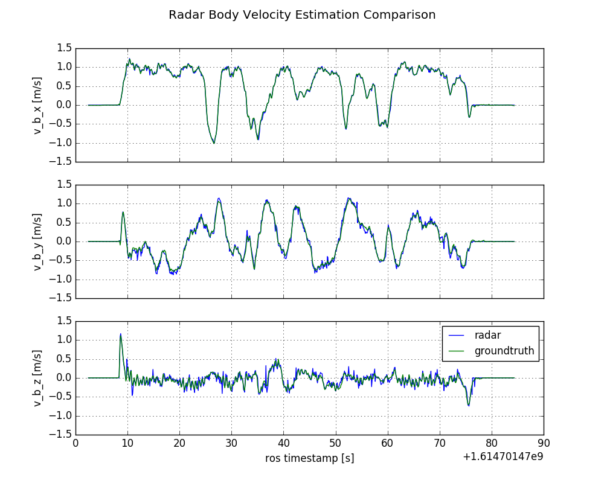
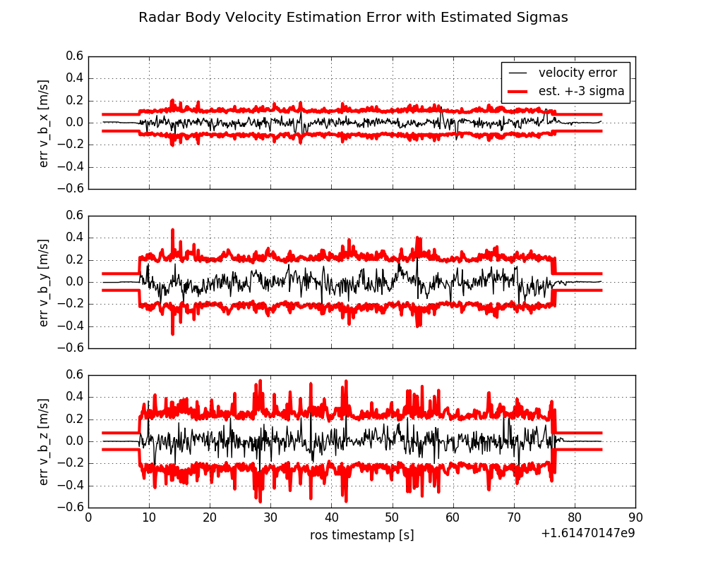

# Radar Ego Velocity Estimation

This package provides an efficient C++ implementation of Radar based ego velocity estimation.
It is an instantaneous approach estimating the ego velocity based on single Radar scan only, no scan matching is required.

The 3D radar ego velocity is estimated with a 3-Point RANSAC Least Squares approach based on a single radar scan making use of the direction and Doppler velocity of each detected object.
In addition, the variances of the resulting 3D ego velocity is estimated as well enabling subsequent fusion.
This approach was evaluated in indoor and outdoor environments for low and high dynamic motion achieving very accurate motion estimation as shown in the demo result.

This package provides also a node which estimates the body frame velocity defined by an IMU using the measured
 angular velocity and extrinsic calibration (body frame to radar frame transform).

## Cite
If you use our radar ego velocity estimation for your academic research, please cite our related paper:

~~~[bibtex]
@INPROCEEDINGS{DoerMFI2020, 
  author={Doer, Christopher and Trommer, Gert F.},
  booktitle={2020 IEEE International Conference on Multisensor Fusion and Integration for Intelligent Systems (MFI)}, 
  title={An EKF Based Approach to Radar Inertial Odometry}, 
  year={2020},
  pages={152-159},
  doi={10.1109/MFI49285.2020.9235254}}
~~~

## Demo Result
The demo dataset [vicon_easy](../demo_datasets/vicon_easy.bag) yields the results below.

Mean runtime to process a single radar scan on an Intel NUC i7-8650U is just 0.15 milliseconds.

Error analysis of the body-frame velocity in [m/s]:
- Mean error: 0.000, -0.006, -0.001
- Mean absolute error: 0.015, 0.040, 0.042
- Mean error norm: 0.068
- RMSE: 0.050
- Error STD: 0.020, 0.055, 0.065

## Getting Started
Run the demo launch file which also does an evaluation and generates the twos plots shown above:
~~~[shell]
roslaunch radar_ego_velocity_estimation demo_datasets_radar_body_velocity_estimator_rosbag.launch
~~~

Run with the vicon_medium demo dataset:
~~~[shell]
roslaunch radar_ego_velocity_estimation demo_datasets_radar_body_velocity_estimator_rosbag.launch rosbag:=vicon_medium.bag
~~~

Run the body velocity estimation in online mode:
~~~[shell]
roslaunch radar_ego_velocity_estimation demo_datasets_radar_body_velocity_estimator_ros.launch
rosbag play --clock vicon_easy.bag
~~~

## Nodes
### radar_body_velocity_estimation_ros_node
Implements a ROS interface for online processing.
Subscribes to a Radar scan, Radar trigger, Imu data, estimates the body velocity and publishes the result.
The IMU data is used to transform the radar ego velocity into the body frame based on the extrinsic calibration.
Online parameter tuning is supported using rqt_reconfigure.
- Parameters:
  - ~topic_radar_scan: [PointCloud2](http://docs.ros.org/en/api/sensor_msgs/html/msg/PointCloud2.html) subscriber topic, the point cloud data has to be structured as described [here](../demo_datasets/README.md)
  - ~topic_radar_trigger: [Header](http://docs.ros.org/en/api/std_msgs/html/msg/Header.html) subscriber topic providing the exact radar scan time stamp
  - ~topic_imu: [Imu](http://docs.ros.org/en/api/sensor_msgs/html/msg/Imu.html) subscriber topic
  - ~topic_twist: [TwistWithCovarianceStamped](http://docs.ros.org/en/api/geometry_msgs/html/msg/TwistWithCovarianceStamped.html) publisher topic
  - extrinsic transform of the body frame (IMU) to the radar frame --> see [calib_demo_datasets](../demo_datasets/calib_demo_datasets.yaml)

### radar_body_velocity_estimation_rosbag_node
Implements a ROS interface for postprocessing of a rosbag.
In contrast to the ros node above, the configured topics are directly read from the rosbag.

### radar_ego_velocity_estimator_node
Demo node for the Radar ego velocity estimation only.
Subscribes to a Radar scan, estimates the Radar ego velocity and publishes the result. 
Online parameter tuning is supported using rqt_reconfigure.
- Parameters: 
  - ~topic_radar_data: [RadarScan](../radar_msgs/msg/RadarScan.msg) subscriber topic
  - ~topic_twist: [TwistWithCovarianceStamped](http://docs.ros.org/en/api/geometry_msgs/html/msg/TwistWithCovarianceStamped.html) publisher topic
   