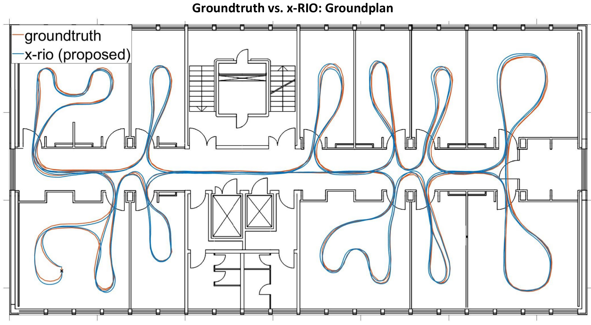

# x_rio: Radar Inertial Odometry with Multiple Radar Sensors and Yaw Aiding

This package generalizes [ekf_rio](../ekf_rio) and [ekf_yrio](../ekf_yrio) for multi radar sensor setups and provides a faster implementation using approximated radar clones.
We used an instantaneous approach which can provide yaw aiding without scan matching.
An evaluation with the [Multi Radar Inertial Datasets JGN 2022](https://christopherdoer.github.io/datasets/multi_radar_inertial_datasets_JGN2022) shows that x_rio achieves even better accuracies than the state of the art VIO framework [Stereo VINS (no loop closures)](https://github.com/HKUST-Aerial-Robotics/VINS-Fusion).
We highly outperform VINS regarding runtime as x_rio with a single radar sensor runs >125x and even with two radar sensors almost 90x faster than VINS!

Check out our paper for more details [x-RIO: Radar Inertial Odometry with Multiple Radar Sensors and Yaw Aiding](https://christopherdoer.github.io/publication/2022_02_JGN2022).

## Cite
If you use x_rio or the provided datasets for your academic research, please cite our related paper:

~~~[bibtex]
@INPROCEEDINGS{DoerJGN2022,
    author = {Doer, Christopher and Trommer, Gert F.},
    year = {2022},
    month = {02},
    pages = {329-339},
    title = {x-RIO: Radar Inertial Odometry with Multiple Radar Sensors and Yaw Aiding},
    volume = {12},
    journal = {Gyroscopy and Navigation}}
~~~
## Demos

### Autonomous Radar Inertial Drone Navigation even in Dense Fog 

## Office floor
The image below compares x_rio (blue) against groundtruth (red) on the office_floor datasets which is part of the [Multi Radar Inertial Datasets JGN 2022](https://christopherdoer.github.io/datasets/multi_radar_inertial_datasets_JGN2022).
This trajectory covers 425m including two loops of the approximate same path.
The final position error is just 0.25m which corresponds to 0.1% of the trajectory length.

## Results on  [Multi Radar Inertial Datasets JGN 2022](https://christopherdoer.github.io/datasets/multi_radar_inertial_datasets_JGN2022)
Results comparing vins and x_rio regarding different radar sensor setups.
Using two radar sensors (left and right) or even three radar sensors (left, center, right) improves the accuracy.

### Evaluation x_rio without barometer and yaw aiding
| Algorithm | office_floor | lab_floor | basement | workshop | Mean 
--- | --- | --- | --- | --- | --- |
[VINS Stereo (no loop closures)](https://github.com/HKUST-Aerial-Robotics/VINS-Fusion) |0.48|0.47|0.52|0.18|0.41
x_rio_plain_left |0.23|0.27|0.55|0.49|0.39
x_rio_plain_right |0.40|0.33|0.53|0.43|0.42
x_rio_plain_center |0.59|0.91|2.21|0.53|1.06
x_rio_plain_left_right |0.17|0.34|0.58|0.43|0.38
x_rio_plain_left_center_right |0.16|0.32|0.62|0.38|0.37

### Evaluation x_rio with barometer and yaw aiding
| Algorithm | office_floor | lab_floor | basement | workshop | Mean 
--- | --- | --- | --- | --- | --- |
[VINS Stereo (no loop closures)](https://github.com/HKUST-Aerial-Robotics/VINS-Fusion) |0.48|0.47|0.52|0.18|0.41
x_rio_baro_yaw_left |0.14|0.28|0.51|0.22|0.29
x_rio_baro_yaw_right |0.20|0.26|0.24|0.31|0.25
x_rio_baro_yaw_center |0.34|0.39|0.50|0.40|0.41
x_rio_baro_yaw_left_right |0.18|0.18|0.37|0.18|0.23
x_rio_baro_yaw_left_center_right |0.13|0.22|0.40|0.19|0.24

## Getting Started

Run x_rio on the demo indoor datasets in rosbag mode, start rviz and plots:

~~~[shell]
roslaunch x_rio x_rio_demo.launch type:=rosbag_node enable_rviz:=True enable_plot:=True
~~~

Run x_rio using only two radar sensors:

~~~[shell]
roslaunch x_rio x_rio_demo.launch type:=rosbag_node enable_rviz:=True enable_plot:=False n_radar:=2
~~~

Run in online mode:

~~~[shell]
roslaunch x_rio x_rio_demo.launch type:=ros_node enable_rviz:=True enable_plot:=False
rosbag play --clock demo_x_rio.bag
~~~

Run simulation for a setup of three radar sensors and 10 Monte Carlo runs:

~~~[shell]
rosrun x_rio run_sim.py 
~~~

## Run the multi_radar_inertial_datasets_jgn_2022
Run and evaluate all runs of the  [Multi Radar Inertial Datasets JGN 2022](https://christopherdoer.github.io/datasets/multi_radar_inertial_datasets_JGN2022) which produces the results shown in the two tables above:

~~~[shell]
rosrun x_rio evaluate_jgn2022_datasets.py _rosbag_base_dir:=<path_to_jgn2022_datasets> _eval_name:=<eval_name>
~~~

This will save the evaluation at <path_to_jgn2022_datasets>/results for all datasets.
The estimation result of x_rio without and with barometer and yaw aiding for different radar sensor combinations are aligned with the ground truth and evaluated using 
[rpg_trajectory_evaluation](https://github.com/christopherdoer/rpg_trajectory_evaluation). 
Plots and further error metrics are located at <path_to_jgn2022_datasets>/results/evaluation_full_align.

## Nodes

Our x_rio implementation provides two nodes for ROS interfacing:
- ***ros_node:*** Subscribes to all topics and does online processing
- ***rosbag_node:*** Reads a rosbag and runs x_rio at maximum speed

A set of demo parameters is given in [x_rio_demo_params](./config/x_rio_demo_params.yaml).
Most of the parameters can be changed online using rqt_reconfigure. Further documentation of the parameters can be found using the tooltip text in rqt_reconfigure
and in the python files, see [cfg](./cfg).

Published topics are the same for both modes:
- ~state ([rio/XRioState](./msg/XRioState.msg)): full filter state (NED-convention)
- ~covariance ([rio/XRioCovariance](./msg/XRioCovariance.msg)): diagonal elements of covariance matrix
- ~pose ([geometry_msgs/PoseStamped](http://docs.ros.org/en/api/geometry_msgs/html/msg/PoseStamped.html])): pose (ROS convention)
- ~twist ([geometry_msgs/TwistStamped](http://docs.ros.org/en/api/geometry_msgs/html/msg/TwistStamped.html])): twist (ROS convention)
- ~pose_path ([nav_msgs/Path](http://docs.ros.org/en/api/nav_msgs/html/msg/Path.html)): pose path (ROS convention)
- ~combined_scan ([sensor_msgs/PointCloud2](http://docs.ros.org/en/api/sensor_msgs/html/msg/PointCloud2.html)): most recent scans of each radar sensor combined into a single scan given in the body frame
- ~yaw_aiding_init ([sensor_msgs/PointCloud2](http://docs.ros.org/en/api/sensor_msgs/html/msg/PointCloud2.html)): all radar scan point used for Manhattan angle init
- ~radar_scan_yaw_inlier ([sensor_msgs/PointCloud2](http://docs.ros.org/en/api/sensor_msgs/html/msg/PointCloud2.html)): radar scan point used for yaw aiding
